# Service Provider Onboarding Portal (Trizen Ventures)

A production-ready Full Stack MERN Service Provider Onboarding Portal inspired by hyper-growth platforms such as **Urban Company** and **ExtraHand**. 

Designed for **Trizen Ventures** Full Stack Development Intern technical assignment, this platform enables blue-collar and trade service professionals to apply, upload credentials, and complete a multi-step verification process, while providing platform administrators with an auditing and moderation suite to inspect documents, analyze compliance, and approve or reject submissions with structured feedback.

---

## Live Deployments

* **Frontend Web Portal (Vercel):** [https://trizen-provider-onboarding.vercel.app](https://trizen-provider-onboarding.vercel.app/)
* **Backend REST API (Render):** [https://trizen-provider-onboarding-api.onrender.com](https://trizen-provider-onboarding-api.onrender.com/)
* **API Health Check:** [https://trizen-provider-onboarding-api.onrender.com/api/health](https://trizen-provider-onboarding-api.onrender.com/api/health)

---

## Table of Contents
1. [Live Deployments](#live-deployments)
2. [System Architecture](#system-architecture)
2. [Key Features](#key-features)
   - [Service Provider Experience](#service-provider-experience)
   - [Administrative Moderation Console](#administrative-moderation-console)
3. [Provider Lifecycle State Machine](#provider-lifecycle-state-machine)
4. [Technology Stack](#technology-stack)
5. [Project Structure](#project-structure)
6. [Database Schema Design](#database-schema-design)
7. [REST API Directory](#rest-api-directory)
8. [File Upload Architecture](#file-upload-architecture)
9. [Local Development Setup](#local-development-setup)
10. [Environment Variables](#environment-variables)
11. [Demo Credentials](#demo-credentials)
12. [Visual Screenshots Gallery](#visual-screenshots-gallery)
13. [Postman API Collection](#postman-api-collection)
13. [Deployment Guide (Vercel + Render + MongoDB Atlas)](#deployment-guide)
14. [Demo Video Presentation Script](#demo-video-presentation-script)
15. [Architectural Design Decisions](#architectural-design-decisions)
16. [Known Limitations](#known-limitations)

---

## System Architecture

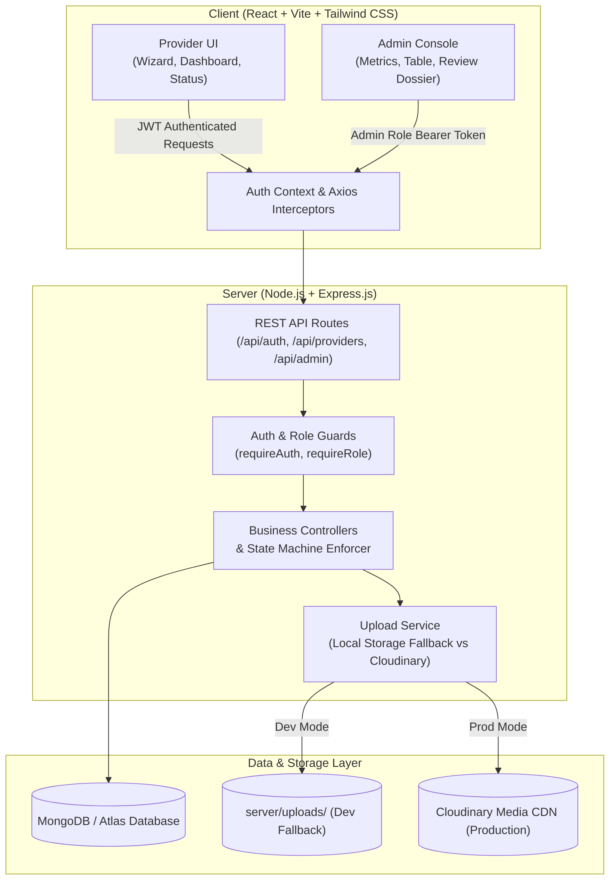

---

## Key Features

### Service Provider Experience
* **Self-Service Registration & Authentication**: Secure sign-up with password hashing (`bcryptjs`) and automatic initialization of a `draft` onboarding dossier.
* **5-Step Guided Onboarding Wizard**:
  - **Step 1: Personal Dossier**: Full name, contact phone, professional biographical summary, and front-facing profile photo upload with live preview.
  - **Step 2: Services & Experience**: Multi-select grid with realistic categories (*Electrician, Plumber, Carpenter, Painter, AC Technician, Appliance Repair, Cleaning, Beauty & Salon, Driver, Tutor, Pest Control, Other*), interactive tagging for specialized tools/skills, and a numeric experience counter.
  - **Step 3: Service Locations**: Geographic coverage selector with tag-based neighborhood and city assignment.
  - **Step 4: Verification Documents**: Document upload supporting PDF and image formats (Identity proofs, Address proofs, Trade certificates) with client-side and server-side size/MIME verification.
  - **Step 5: Review & Submit**: Comprehensive review dossier with completeness validation checklist preventing incomplete submissions.
* **State-Aware Provider Dashboard**:
  - Status banner with distinctive visual indicators (`Draft`, `Under Review`, `Approved`, `Needs Changes`).
  - Dynamic profile completeness percentage meter.
  - Quick-action buttons to update, track status, or preview uploaded documents.
* **Application Lifecycle Tracker**: Chronological visual timeline displaying account registration, submission timestamp, review timestamp, and reviewer feedback.
* **Correction & Resubmission Flow**: If rejected, providers see the reviewer's feedback remarks, the profile automatically unlocks for corrections and replacement file uploads, and resubmitting transitions the status back to `pending`.

### Administrative Moderation Console
* **Dedicated Admin Authentication**: Secure login portal with role-based JWT verification (`requireRole('admin')`).
* **KPI Metrics Dashboard**:
  - Live counts for Total Providers, Pending Applications, Approved Partners, Rejected/Returned, and Incomplete Drafts.
  - Trade/Category distribution breakdown.
  - Quick-review table for recently active submissions.
* **Provider Management Table**:
  - Server-side search across provider full names, applicant email, and phone numbers.
  - Status filtering pills (*All, Pending Review, Approved, Rejected, Draft*).
  - Trade category filtering dropdown.
  - Server-side pagination controls (custom limit, page counters, and navigation controls).
* **Detailed Applicant Dossier Review**:
  - Full view of applicant qualifications, trade categories, experience, bio, and operational areas.
  - In-browser **Document Viewer Modal** supporting PDF rendering and image preview with metadata display and download capabilities.
  - **One-Click Approval** with confirmation modal.
  - **Reject with Mandatory Feedback**: Modal enforcing non-empty rejection remarks explaining why an application needs changes, with pre-populated common feedback templates.

---

## Provider Lifecycle State Machine

The application enforces a strict backend state machine that governs what data can be viewed or updated at any point:

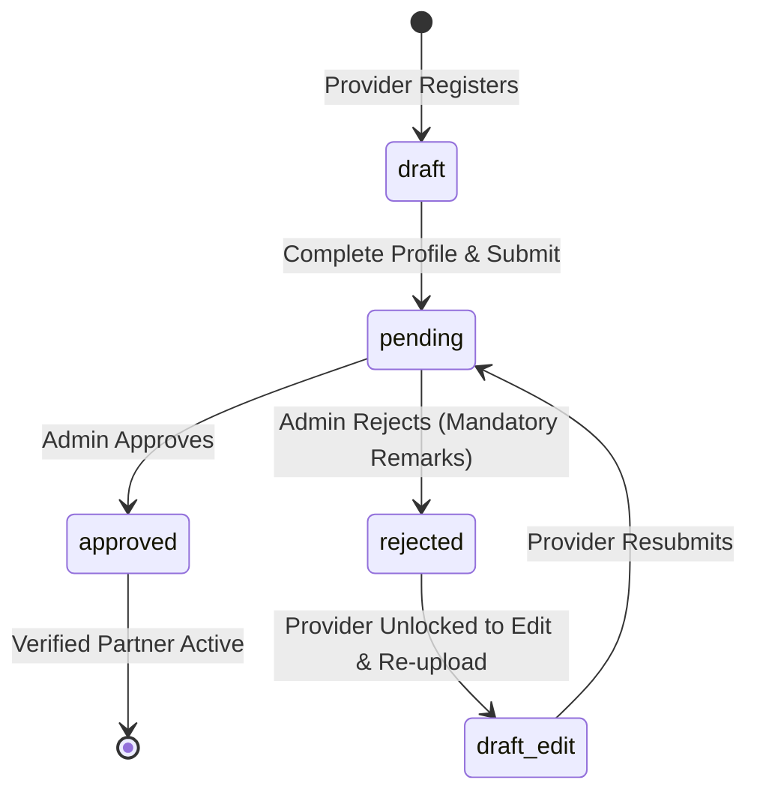

### State Machine Rules (Enforced in Express Backend):
| Status | Editing Allowed? | Document Upload/Delete? | Submission Allowed? | Notes |
| :--- | :---: | :---: | :---: | :--- |
| **`draft`** | Yes | Yes | Yes (if complete) | Profile under initial construction. |
| **`pending`** | **No (HTTP 403)** | **No (HTTP 403)** | No | Application locked while under operational review. |
| **`rejected`** | **Yes** | **Yes** | **Yes** | Provider reviews admin remarks, fixes issues, and resubmits. |
| **`approved`** | **No (HTTP 403)** | **No (HTTP 403)** | No | Verified partner profile is locked from unvetted alterations. |

---

## Technology Stack

- **Frontend**: React 18, Vite, React Router v6, Axios, Tailwind CSS, Lucide React icons
- **Backend**: Node.js, Express.js, MongoDB, Mongoose ODM, JSON Web Tokens (JWT), Bcryptjs, Multer, Helmet, CORS
- **Upload Storage**: Dual-mode upload architecture:
  - *Development*: Local filesystem storage (`server/uploads/`) with static serving.
  - *Production*: Cloudinary media CDN integration.
- **Database**: MongoDB (Local instance or MongoDB Atlas in cloud)
- **Deployment Targets**: Frontend on **Vercel**, Backend on **Render**, Database on **MongoDB Atlas**

---

## Project Structure

```
trizen-provider-onboarding/
├── client/                               # Frontend React + Vite Application
│   ├── public/                           # Static assets (favicons, svgs)
│   ├── src/
│   │   ├── components/
│   │   │   ├── common/                  # Navbar, StatusBadge, Modal, LoadingSpinner, EmptyState, StatCard, ProtectedRoute
│   │   │   ├── forms/                   # TagInput, FileUploadDropzone
│   │   │   └── admin/                   # RejectModal, DocumentViewerModal
│   │   ├── context/                     # AuthContext (state, login, register, logout, session restoration)
│   │   ├── pages/
│   │   │   ├── auth/                    # Login, Register, AdminLogin
│   │   │   ├── provider/                # ProviderDashboard, ProviderOnboarding, ProviderStatus
│   │   │   └── admin/                   # AdminDashboard, AdminProvidersList, AdminProviderDetail
│   │   ├── services/                    # api.js (Axios instance + URL resolvers), authService, providerService, adminService
│   │   ├── utils/                       # constants.js (categories, document types, status color configs)
│   │   ├── App.jsx                      # Main application routing and route guards
│   │   ├── main.jsx                     # Entrypoint mounting DOM
│   │   └── index.css                    # Tailwind directives and custom scrollbars
│   ├── index.html
│   ├── vite.config.js
│   ├── tailwind.config.js
│   └── package.json
│
├── server/                               # Backend Node.js + Express REST API
│   ├── config/                          # db.js (Mongoose connection), cloudinary.js (CDN config)
│   ├── controllers/                     # authController.js, providerController.js, adminController.js
│   ├── middleware/                      # authMiddleware.js (requireAuth, requireRole), uploadMiddleware.js (Multer), errorHandler.js
│   ├── models/                          # User.js (Bcrypt hashing, toJSON), ProviderProfile.js (lifecycle state machine)
│   ├── routes/                          # authRoutes.js, providerRoutes.js, adminRoutes.js
│   ├── services/                        # uploadService.js (Dual-mode abstraction), statsService.js
│   ├── utils/                           # apiResponse.js (standardized responses), seedAdmin.js (Admin initialization)
│   ├── uploads/                         # Gitignored directory for local development uploads
│   ├── app.js                           # Express application configuration
│   ├── server.js                        # Server listener and graceful shutdown
│   └── package.json
│
├── postman/
│   └── Trizen-Onboarding.postman_collection.json # 16-request postman collection with automated test scripts
├── screenshots/                         # Captured user flow screens
├── .gitignore                           # Excludes node_modules, .env, uploads/*, dist/
├── .env.example                         # Environment configuration reference
├── package.json                         # Root convenience scripts (dev, seed, install)
└── README.md                            # Comprehensive evaluator documentation
```

---

## Database Schema Design

### 1. `User` Schema
| Field | Type | Rules | Description |
| :--- | :--- | :--- | :--- |
| `name` | String | Required, trimmed, min 2 | Full name of the account holder |
| `email` | String | Required, unique, lowercase, trimmed, indexed | Unique login credential |
| `password` | String | Required, min 6, hashed with bcrypt | Secure salted password hash (never returned in responses) |
| `role` | String | Enum: `['provider', 'admin']`, default: `'provider'` | Role determining authorization level |
| `timestamps` | Date | Auto-managed | `createdAt`, `updatedAt` |

### 2. `ProviderProfile` Schema
| Field | Type | Rules | Description |
| :--- | :--- | :--- | :--- |
| `user` | ObjectId | Ref: `'User'`, required, unique, indexed | 1-to-1 association with user account |
| `fullName` | String | Default: `''`, trimmed | Provider display name |
| `phone` | String | Default: `''`, trimmed | Contact phone number |
| `bio` | String | Default: `''`, max 1000 | Professional summary |
| `profilePhoto` | Object | `{ url, fileName, publicId }` | Profile picture metadata |
| `categories` | [String] | Array of valid categories | Applied trade categories |
| `skills` | [String] | Array of skill strings | Specialized tools and trade competencies |
| `experience` | Number | Min: 0, default: 0 | Total years of field experience |
| `serviceLocations` | [String] | Array of strings | Serviceable areas and cities |
| `documents` | [DocumentSubdoc] | Array of document objects | Verification credentials |
| `status` | String | Enum: `['draft', 'pending', 'approved', 'rejected']`, default: `'draft'` | Current state machine lifecycle phase |
| `rejectionRemarks` | String | Default: `''` | Review feedback provided by admin upon rejection |
| `submittedAt` | Date | Default: `null` | Timestamp when provider submitted application |
| `reviewedAt` | Date | Default: `null` | Timestamp when admin approved or rejected |

### 3. `Document` Subdocument Schema
- `documentType`: String (`identity` | `address` | `certificate` | `other`)
- `fileName`: String (Original uploaded filename)
- `fileUrl`: String (Local URL path `/uploads/...` or Cloudinary secure URL)
- `publicId`: String (Local filename or Cloudinary public_id for deletion)
- `fileSize`: Number (Byte size)
- `uploadedAt`: Date (Timestamp)

---

## REST API Directory

All responses adhere to standardized JSON payloads:
- Success: `{ "success": true, "message": "...", "data": {} }`
- Failure: `{ "success": false, "message": "...", "errors": [] }`

### Authentication (`/api/auth`)
| Method | Endpoint | Access | Description |
| :--- | :--- | :--- | :--- |
| `POST` | `/api/auth/register` | Public | Registers a new provider, initializes draft profile, returns JWT |
| `POST` | `/api/auth/login` | Public | Authenticates provider or admin credentials, returns JWT |
| `GET` | `/api/auth/me` | Authenticated | Retrieves current authenticated user details and profile |

### Provider Workflow (`/api/providers/me`)
*All endpoints protected with `requireAuth` + `requireRole('provider')`*
| Method | Endpoint | Allowed States | Description |
| :--- | :--- | :--- | :--- |
| `GET` | `/api/providers/me` | Any | Retrieves provider's own profile and completion percentage |
| `PUT` | `/api/providers/me` | `draft`, `rejected` | Updates personal details, categories, skills, experience, locations |
| `POST` | `/api/providers/me/photo` | `draft`, `rejected` | Uploads and updates profile photo (Multipart `photo`) |
| `POST` | `/api/providers/me/documents`| `draft`, `rejected` | Uploads verification document (Multipart `document`, `documentType`) |
| `DELETE` | `/api/providers/me/documents/:id` | `draft`, `rejected` | Deletes an uploaded document |
| `POST` | `/api/providers/me/submit` | `draft`, `rejected` | Validates completeness and transitions status to `pending` |
| `GET` | `/api/providers/me/status` | Any | Retrieves status timeline, timestamps, and admin remarks |

### Administrative Review (`/api/admin`)
*All endpoints protected with `requireAuth` + `requireRole('admin')`*
| Method | Endpoint | Description |
| :--- | :--- | :--- |
| `GET` | `/api/admin/dashboard/stats` | Returns aggregate counts, category distribution, and recent queue |
| `GET` | `/api/admin/providers` | Query params: `page`, `limit`, `search`, `status`, `category` |
| `GET` | `/api/admin/providers/:id` | Returns complete provider dossier and uploaded documents |
| `PATCH`| `/api/admin/providers/:id/approve` | Approves provider, sets status to `approved`, stamps `reviewedAt` |
| `PATCH`| `/api/admin/providers/:id/reject` | Validates mandatory `remarks`, sets status to `rejected` |

---

## File Upload Architecture

The application implements an **Automatic Dual-Mode Upload Abstraction** located in [`server/services/uploadService.js`](server/services/uploadService.js):

1. **Development Mode (Zero-Dependency Fallback)**:
   - When Cloudinary environment variables are not supplied, files are saved locally into `server/uploads/` using unique timestamps and sanitized filenames.
   - Files are served statically via Express at `/uploads/...`.
   - **Important Note**: Local filesystem storage is intended **strictly for local development** because serverless platforms (e.g. Render free tier, Vercel) have ephemeral filesystems where locally saved files are wiped on server restart or redeployment.
2. **Production Mode (Recommended for Cloud Hosting)**:
   - When `CLOUDINARY_CLOUD_NAME`, `CLOUDINARY_API_KEY`, and `CLOUDINARY_API_SECRET` are present in `server/.env`, uploads are automatically streamed directly to **Cloudinary CDN**.
   - Generates persistent, high-availability `https://` URLs that persist across redeploys.
   - Deletions are executed against Cloudinary via `cloudinary.uploader.destroy()`.

---

## Local Development Setup

### Prerequisites
- **Node.js** v18 or higher (v20+ recommended)
- **MongoDB** running locally on port `27017` or a MongoDB Atlas connection string
- **Git**

### 1. Clone & Install Dependencies
```bash
# Clone the repository
git clone https://github.com/Varshith-kummarikunta/trizen-provider-onboarding.git
cd trizen-provider-onboarding

# Install all dependencies across root, server, and client in one command:
npm run install:all
```

### 2. Configure Environment Files

**Server Configuration (`server/.env`):**
```env
PORT=5000
NODE_ENV=development
MONGODB_URI=mongodb://127.0.0.1:27017/trizen_onboarding
JWT_SECRET=trizen_super_secure_jwt_secret_dev_key_2026_!@#
JWT_EXPIRES_IN=7d
CLIENT_URL=http://localhost:5173

# Demo Admin Seed Configuration
ADMIN_NAME=Trizen Platform Admin
ADMIN_EMAIL=admin@trizen.com
ADMIN_PASSWORD=Admin@123

# Cloudinary (Leave blank for automatic local storage fallback in development)
CLOUDINARY_CLOUD_NAME=
CLOUDINARY_API_KEY=
CLOUDINARY_API_SECRET=
```

**Client Configuration (`client/.env`):**
```env
VITE_API_URL=http://localhost:5000/api
```

### 3. Seed Demo Administrator
The backend automatically bootstraps the administrator account on startup. You can also run the seed script manually at any time:
```bash
npm run seed:admin
# Output: Successfully created Demo Admin: admin@trizen.com
```

### 4. Start Development Servers
Run both backend and frontend concurrently from the root directory:
```bash
npm run dev
```
Alternatively, in separate terminal tabs:
```bash
# Terminal 1: Backend Server (Port 5000)
cd server
npm run dev

# Terminal 2: Frontend Client (Port 5173 / 5174)
cd client
npm run dev
```

Visit the application at: **`http://localhost:5173`** (or displayed Vite local port).

---

## Demo Credentials

For testing and evaluation:
* **Administrator:** The admin account is active in production Atlas and automatically maintained on server boot.
* **Service Provider:** Evaluators can register new service provider accounts freely via the sign-up portal. Note that `rajesh.sharma@example.com` is an **example payload** used in Postman tests and is **not** a pre-seeded production account.

| Role | Email | Password | Access Portal | Status / Access Type |
| :--- | :--- | :--- | :--- | :--- |
| **Administrator** | `admin@trizen.com` | `Admin@123` | [Admin Portal (`/admin/login`)](https://trizen-provider-onboarding.vercel.app/admin/login) *(or local `/admin/login`)* | **Active Pre-seeded Admin** *(Features 1-click Auto-Fill button)* |
| **Test Provider** | `rajesh.sharma@example.com` *(or any email)* | `ProviderPass@123` | [Partner Sign In (`/login`)](https://trizen-provider-onboarding.vercel.app/login) / [Registration (`/register`)](https://trizen-provider-onboarding.vercel.app/register) | **Example Registration Payload** *(Register freely via UI or Postman)* |

*Note: The Admin Login portal includes a **Demo Quick-Fill button** that fills credentials (`admin@trizen.com / Admin@123`) with one click for effortless evaluation testing.*

---

## Visual Screenshots Gallery

| Screen | Preview |
| :--- | :--- |
| **Partner Login** | 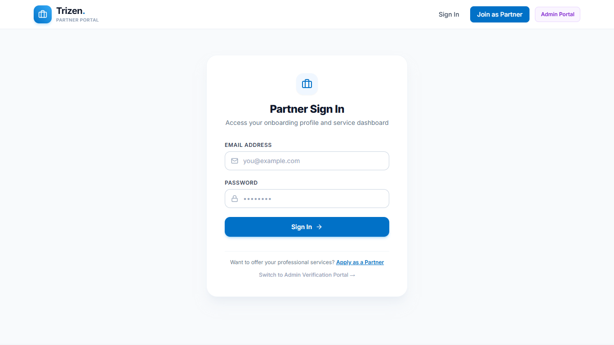 |
| **Partner Registration** | 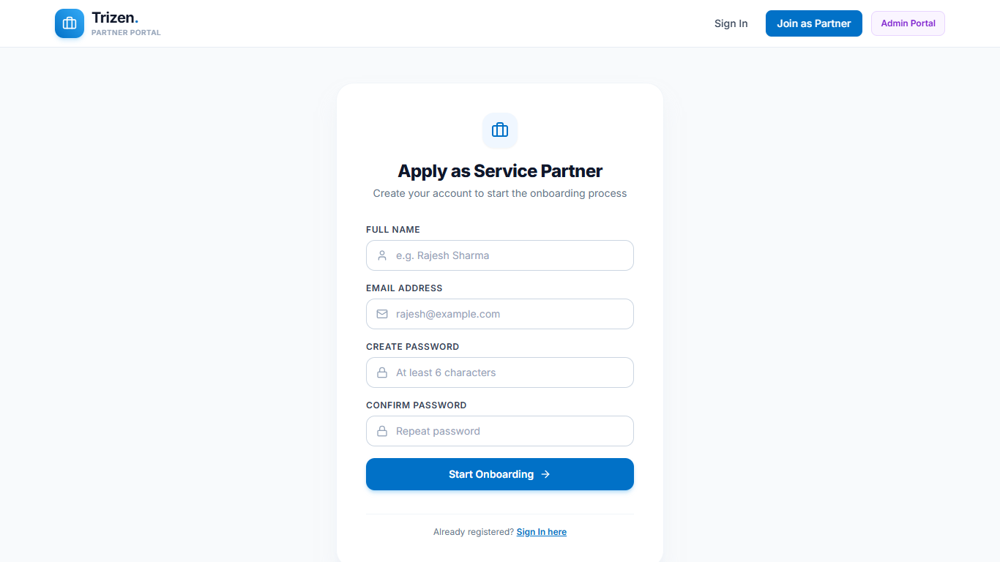 |
| **Admin Login (with Demo Quick-Fill)** | 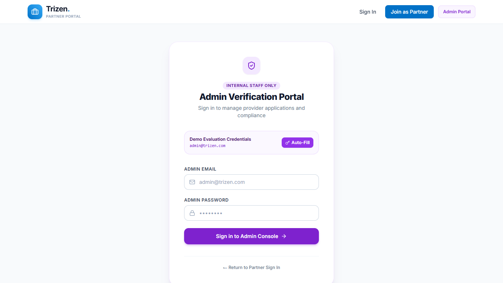 |
| **Provider Dashboard & Completeness Meter** | 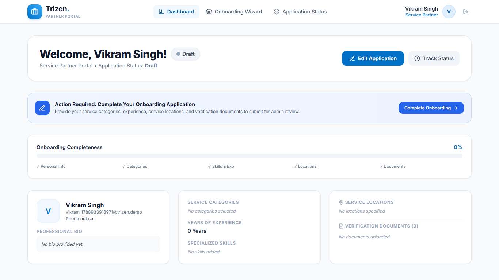 |
| **Provider 5-Step Onboarding Wizard** | 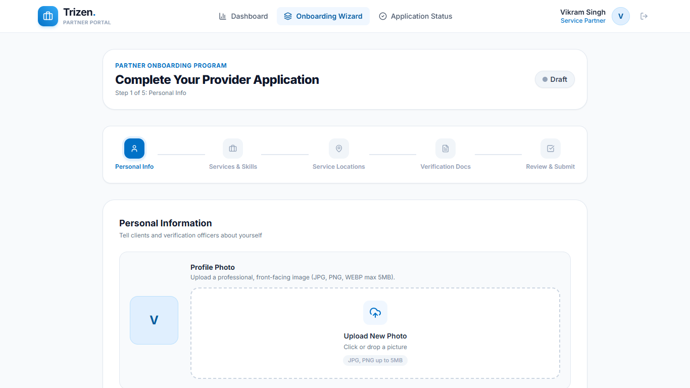 |
| **Application Status Timeline Tracker** | 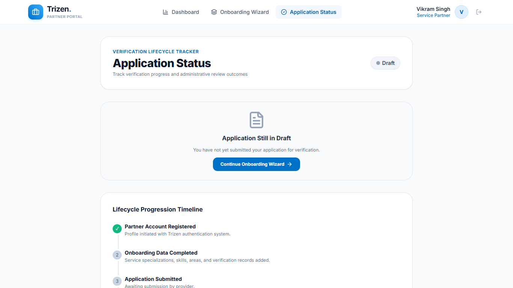 |
| **Admin Operations Dashboard** | 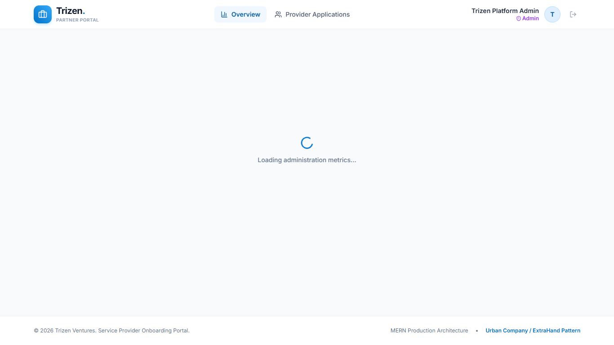 |
| **Provider Applications Table (Filters/Pagination)** | 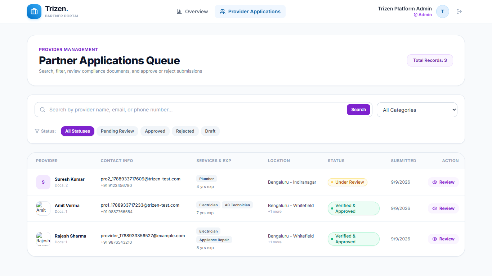 |
| **Applicant Review Dossier (Inspect/Approve/Reject)** | 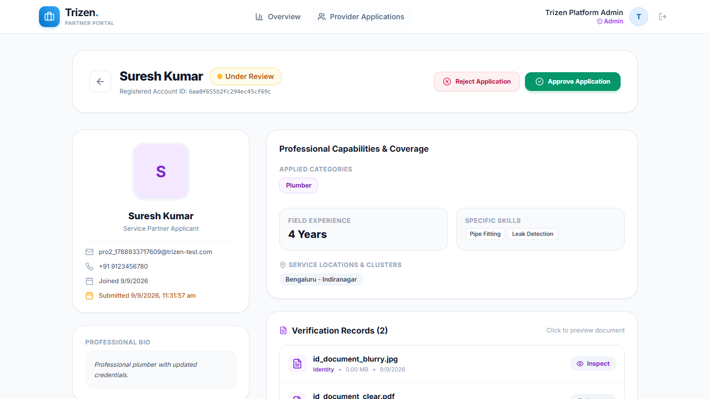 |
| **Responsive Mobile Layout** | 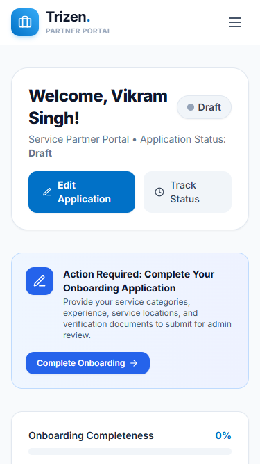 |

---

## Postman API Collection

A fully configured Postman Collection is located in:
[`postman/Trizen-Onboarding.postman_collection.json`](postman/Trizen-Onboarding.postman_collection.json)

### Key Collection Features:
- Pre-configured collection variables: `baseUrl`, `providerToken`, `adminToken`, `providerProfileId`, `documentId`.
- **Automated Test Scripts**: Running the *Register* or *Login* requests automatically captures the JWT token and extracts variables into Postman so subsequent calls execute seamlessly without manual copy-pasting.
- Covers 16 distinct endpoints across Authentication, Provider Onboarding, Document Management, and Admin Moderation.

### How to Import & Run:
1. Open Postman &rarr; Click **Import** &rarr; Select `postman/Trizen-Onboarding.postman_collection.json`.
2. Ensure variable `baseUrl` is set to `http://localhost:5000/api`.
3. Run `1.3 Admin Login` &rarr; `adminToken` will automatically populate.
4. Run `1.1 Provider Registration` &rarr; `providerToken` will automatically populate.
5. Execute requests sequentially to test the full lifecycle.

---

## Deployment Guide

### 1. Database Deployment (MongoDB Atlas)
1. Create a free cluster on [MongoDB Atlas](https://www.mongodb.com/cloud/atlas).
2. Under **Network Access**, allow access from anywhere (`0.0.0.0/0`) to permit Render connection.
3. Under **Database Access**, create a user with read/write permissions.
4. Obtain the connection string:
   `mongodb+srv://<username>:<password>@cluster0.mongodb.net/trizen_onboarding?retryWrites=true&w=majority`

### 2. Backend Deployment (Render)
1. Push your repository to GitHub.
2. Log into [Render](https://render.com/) &rarr; Click **New** &rarr; **Web Service**.
3. Connect your repository.
4. Configure settings:
   - **Root Directory**: `server`
   - **Runtime**: `Node`
   - **Build Command**: `npm install`
   - **Start Command**: `node server.js`
5. Configure Environment Variables in Render:
   - `PORT`: `5000` (or leave default assigned by Render)
   - `NODE_ENV`: `production`
   - `MONGODB_URI`: `<Your MongoDB Atlas connection string>`
   - `JWT_SECRET`: `<Generate a secure random string>`
   - `CLIENT_URL`: `<Your Vercel frontend URL, e.g. https://trizen-onboarding.vercel.app>`
   - `ADMIN_EMAIL`: `admin@trizen.com` (Optional, defaults to `admin@trizen.com`)
   - `ADMIN_PASSWORD`: `Admin@123` (Optional, defaults to `Admin@123`)
   - `CLOUDINARY_CLOUD_NAME`: `<Your Cloudinary cloud name>`
   - `CLOUDINARY_API_KEY`: `<Your Cloudinary API key>`
   - `CLOUDINARY_API_SECRET`: `<Your Cloudinary API secret>`
6. Deploy the service. The backend server automatically initializes and verifies the administrator account on startup via `bootstrapAdmin()`. (You can also run `node utils/seedAdmin.js` manually in the Render Shell or locally).

### 3. Frontend Deployment (Vercel)
1. Log into [Vercel](https://vercel.com/) &rarr; Click **Add New** &rarr; **Project**.
2. Connect your repository.
3. Configure settings:
   - **Root Directory**: `client`
   - **Framework Preset**: `Vite`
   - **Build Command**: `npm run build`
   - **Output Directory**: `dist`
4. Configure Environment Variables in Vercel:
   - `VITE_API_URL`: `<Your Render Backend URL>/api` (e.g. `https://trizen-api.onrender.com/api`)
5. Deploy. The application is live and fully connected!

---

## Demo Video Presentation Script

A recommended **3 to 5 minute walk-through script** for interview demonstration:

### [0:00 - 0:30] Project Overview & Architecture
- *"Hello! Today I'm demonstrating the Service Provider Onboarding Portal built for Trizen Ventures."*
- *"The system follows the ExtraHand / Urban Company pattern: a modern React + Vite frontend, a secure Express + MongoDB backend with strict lifecycle state machines, and dual-mode file storage."*

### [0:30 - 1:45] Provider Onboarding Walkthrough
- Register a new service partner account (e.g. *Amit Verma*, Electrician).
- Show the 5-step wizard:
  - Step 1: Fill in full name, phone number, bio, and upload a profile photo.
  - Step 2: Select categories (*Electrician*, *AC Technician*), add skills using the interactive tag input, set 7 years experience.
  - Step 3: Add service locations (*Whitefield*, *Indiranagar*).
  - Step 4: Upload trade certification verification document.
  - Step 5: Review summary and submit for verification.
- Point out that status is now **PENDING**, and demonstrate that backend security locks the application from editing while under review.

### [1:45 - 3:00] Admin Moderation & Approval
- Navigate to the Admin Portal (`/admin/login`). Use the 1-click Demo Auto-Fill.
- Show the Dashboard metrics: total providers count, pending review queue count, and category distribution.
- Open the Provider Applications table: demonstrate live search, status filter pills, and category filtering.
- Open *Amit Verma's* application dossier:
  - Inspect his profile, experience, and service areas.
  - Click **Inspect Document** to demonstrate the in-browser document viewer with PDF/image preview.
  - Click **Approve Application**.

### [3:00 - 3:45] Provider Re-verification & Rejection Flow
- Switch back to provider account: demonstrate that status now displays **APPROVED** with verified badge.
- Demonstrate rejection scenario with a second provider:
  - Admin rejects with remarks: *"Please re-upload a clearer ID document."*
  - Provider logs in, sees status **NEEDS CHANGES** with admin remarks displayed prominently.
  - Profile automatically unlocks &rarr; provider uploads replacement file &rarr; resubmits &rarr; status returns to **PENDING**.

### [3:45 - 4:15] Code & Quality Highlights
- Briefly highlight clean code structure: modular controllers, role-based middlewares, centralized error handling, and comprehensive Postman collection with automated test scripts.

---

## Architectural Design Decisions

1. **Backend-Enforced State Machine vs. UI-Only Disabling**:
   - Rather than merely disabling buttons in React, the backend Express controllers explicitly validate the provider's status before allowing updates. Any attempt to modify a `pending` or `approved` profile returns HTTP `403 Forbidden`.
2. **Dual-Mode File Upload Strategy**:
   - For frictionless local development, the app works 100% out of the box with zero third-party dependencies using Multer and local storage. When deploying to cloud environments (where container storage is ephemeral), providing Cloudinary keys automatically transitions the upload pipeline to Cloudinary CDN without altering a single line of application code.
3. **Role Isolation & Protected Registration**:
   - Public registration strictly forces the `provider` role. Administrator accounts cannot be created via the public API, ensuring separation of duties. Administrators are initialized via the protected `seedAdmin.js` script.
4. **Server-Side Pagination & Filtering**:
   - In production platforms, downloading every provider into client memory causes severe performance degradation. The `/api/admin/providers` endpoint performs server-side filtering and pagination, returning metadata (`total`, `page`, `totalPages`, `hasMore`).

---

## Known Limitations

1. **Ephemeral Local Storage on Free Hosting**:
   - When hosted on Render or Vercel without Cloudinary credentials, files stored in `server/uploads/` will disappear on container restart. Configuring Cloudinary environment variables resolves this for persistent production environments.
2. **Email Notifications**:
   - In accordance with the prompt's prioritization guidelines (core stability over optional bells and whistles), transactional emails (e.g. SendGrid / Nodemailer) were deferred. Status updates are communicated through the platform UI.

---

## Final Verification Summary

- **Frontend Production Build (`npm run build` in `client`)**: Passed with 0 compilation errors; optimized bundle size.
- **Backend Syntax & Diagnostics Verification (`node -c`)**: All Express controllers, models, routes, and middlewares verified.
- **Automated Postman Collection (`postman/Trizen-Onboarding.postman_collection.json`)**: 16 comprehensive requests covering authentication, provider onboarding, Cloudinary document uploads, and admin approval/rejection flows with automated assertion tests.
- **Live Production E2E Verification**: Full provider lifecycle (Draft &rarr; Pending &rarr; Approved, Draft &rarr; Pending &rarr; Rejected &rarr; Resubmitted) verified on live Vercel and Render deployments.
